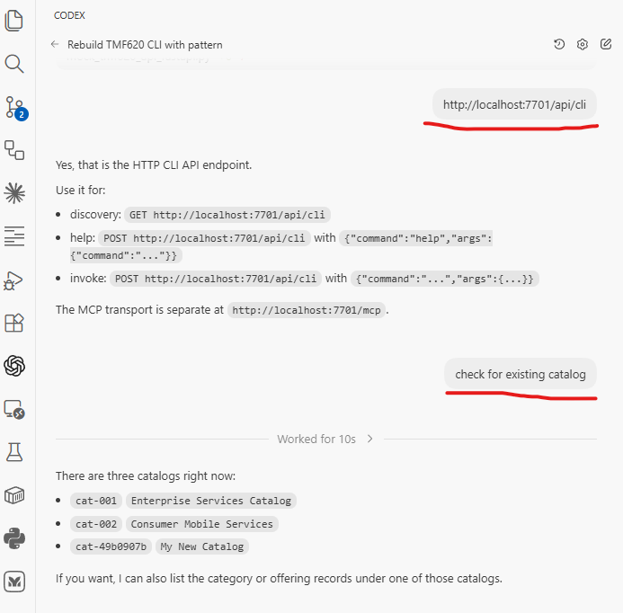

# TMF620 CLI + MCP Server

We are shifting the agent-facing interface toward the HTTP CLI API because it is materially cheaper to discover and easier to expand progressively than exposing the full MCP tool surface on every turn.

Once the stack is running, paste the HTTP CLI API URL into a Codex, Claude, or Cursor chat window and start talking to it. The agent can discover commands through `/api/cli` and invoke them without a separate SDK.

The practical reasons are:

- compact discovery: agents can start with `GET /api/cli` instead of ingesting the full MCP tool list up front
- progressive help: agents can expand one command branch at a time with `help`
- lower token cost: the benchmark in this repo shows the compact CLI path is much smaller than the wrapped MCP tool payload
- simpler automation: `curl` works well for both humans and agents, especially when the command surface is already structured
- one shared command layer: the same command definitions back the HTTP CLI API, the MCP adapter, and the benchmark

The current benchmark numbers are:

- MCP tool surface: `37` generated command tools
- raw MCP discovery payload: `2,992` tokens
- OpenAI-wrapped MCP tool payload: `3,325` tokens
- compact `GET /api/cli`: `254` tokens
- compact group help: `125` tokens
- leaf help: `245` tokens
- compact catalog + group help: `379` tokens
- compact catalog + group help + leaf help: `624` tokens

That matters because many agent runtimes resend the tool list on each model call or session turn. In that common pattern, a large MCP tool surface becomes repeated context cost. Compact CLI discovery avoids paying for every tool up front and instead expands only the branch the agent needs.

This repo is not claiming a universal MCP tool-count limit. The point is more pragmatic: once you have a few dozen tools, full-tool discovery becomes expensive enough that progressive CLI discovery is easier to justify and easier to benchmark.

TMF620 Product Catalog Management with three layers:

- a mock TMF620 API
- a shared Python client
- two adapters over that client: HTTP CLI API and MCP

This keeps the operational logic in one place while supporting HTTP and MCP adapters over the same TMF620 command set.

Request paths:

- HTTP CLI API -> `tmf620_mcp_server.py` -> `tmf620_commands.py` -> `tmf620_core.py` -> TMF620 API
- MCP client -> `tmf620_mcp_server.py` -> `tmf620_core.py` -> TMF620 API

## Components

### 1. Mock TMF620 API

File: `mock_tmf620_api_fastapi.py`

- FastAPI-based TMF620 mock server
- sample catalogs, offerings, and specifications
- Swagger docs and optional MCP exposure

### 2. Shared TMF620 Client

File: `tmf620_core.py`

- config loading
- HTTP request handling
- health checks
- generic CRUD helpers for TMF620 resources
- catalog, category, offering, price, specification, import/export job, and hub operations

### 3. Shared Command Layer

File: `tmf620_commands.py`

- canonical TMF620 command registry
- machine-readable discover/help payloads
- structured command invocation shared by shell and HTTP adapters

### 4. MCP + HTTP CLI Adapter

File: `tmf620_mcp_server.py`

- FastAPI + `fastapi-mcp`
- exposes `/api/cli` for the HTTP CLI API pattern
- exposes the same operations as MCP tools for MCP-capable agents
- delegates HTTP CLI requests into `tmf620_commands.py`
- delegates MCP tools into `tmf620_core.py`

## Docker

Use Docker if you want the mock API and MCP/HTTP CLI stack together in one containerized runtime.

```bash
docker compose up --build
```

The container exposes:

- mock API at `http://localhost:8801/tmf-api/productCatalogManagement/v5`
- MCP transport at `http://localhost:7701/mcp`
- HTTP CLI API at `http://localhost:7701/api/cli`

The container uses environment overrides rather than rewriting config files. Set them in `docker-compose.yml`, or use a `.env` file with Docker Compose:

- `TMF620_API_URL`



## Without Docker

Use this path for local development with `uv`.

### Install dependencies

```bash
uv sync
```

### Start the mock API

```bash
uv run tmf620-mock-server
```

Default API base URL:

```text
http://localhost:8801/tmf-api/productCatalogManagement/v5
```

### Use the HTTP CLI API

```bash
curl http://localhost:7701/api/cli
curl "http://localhost:7701/api/cli?verbose=true"
curl -X POST http://localhost:7701/api/cli \
  -H "Content-Type: application/json" \
  -d '{"command":"help","args":{"command":"catalog list"}}'
curl -X POST http://localhost:7701/api/cli \
  -H "Content-Type: application/json" \
  -d '{"command":"catalog list","args":{"lifecycle_status":"Active","limit":5}}'
curl -X POST http://localhost:7701/api/cli \
  -H "Content-Type: application/json" \
  -d '{"command":"catalog get","args":{"catalog_id":"cat-001"}}'
```

### Start the MCP server

```bash
uv run tmf620-mcp-server
```

Default MCP server URL:

```text
http://localhost:7701
```

HTTP CLI API endpoints:

```text
GET  http://localhost:7701/api/cli
POST http://localhost:7701/api/cli
```

## Configuration

`config.json` is used by both the HTTP CLI API and MCP server:

```json
{
  "mcp_server": {
    "host": "localhost",
    "port": 7701,
    "name": "TMF620 Product Catalog API"
  },
  "tmf620_api": {
    "url": "http://localhost:8801/tmf-api/productCatalogManagement/v5"
  }
}
```

Environment variables override file values at runtime:

- `TMF620_API_URL`

You can also override the config path with `TMF620_CONFIG_PATH`.

## HTTP CLI Commands

```bash
# Discovery
curl http://localhost:7701/api/cli
curl "http://localhost:7701/api/cli?verbose=true"
curl -X POST http://localhost:7701/api/cli \
  -H "Content-Type: application/json" \
  -d '{"command":"help","args":{"command":"offering patch"}}'

# Read/list commands
curl -X POST http://localhost:7701/api/cli \
  -H "Content-Type: application/json" \
  -d '{"command":"category list","args":{"limit":5}}'
curl -X POST http://localhost:7701/api/cli \
  -H "Content-Type: application/json" \
  -d '{"command":"catalog list","args":{"lifecycle_status":"Active","limit":5}}'
curl -X POST http://localhost:7701/api/cli \
  -H "Content-Type: application/json" \
  -d '{"command":"offering list","args":{"catalog_id":"cat-001","limit":10,"offset":5}}'
curl -X POST http://localhost:7701/api/cli \
  -H "Content-Type: application/json" \
  -d '{"command":"price get","args":{"price_id":"pop-001"}}'

# Create/patch commands use JSON bodies because TMF620 resource payloads are wide
curl -X POST http://localhost:7701/api/cli \
  -H "Content-Type: application/json" \
  -d '{"command":"catalog create","args":{"body":{"name":"Business Catalog","lifecycleStatus":"Active"}}}'
curl -X POST http://localhost:7701/api/cli \
  -H "Content-Type: application/json" \
  -d '{"command":"offering patch","args":{"offering_id":"po-001","body":{"description":"Updated description"}}}'
curl -X POST http://localhost:7701/api/cli \
  -H "Content-Type: application/json" \
  -d '{"command":"hub create","args":{"body":{"callback":"https://example.com/hooks/tmf620","query":"eventType=ProductOfferingCreateEvent"}}}'

# Delete commands
curl -X POST http://localhost:7701/api/cli \
  -H "Content-Type: application/json" \
  -d '{"command":"category delete","args":{"category_id":"category-001"}}'
curl -X POST http://localhost:7701/api/cli \
  -H "Content-Type: application/json" \
  -d '{"command":"hub delete","args":{"hub_id":"hub-001"}}'
```

## MCP Usage

Example Claude Desktop config:

```json
{
  "mcpServers": {
    "tmf620-mcp": {
      "command": "uv",
      "args": ["run", "tmf620-mcp-server"],
      "cwd": "/path/to/tmf620-mcp-server"
    }
  }
}
```

Available MCP tools:

- Generated command tools under `/commands/...`, including `tmf620_health`, `tmf620_config`, `tmf620_discover`, and one tool per leaf command in `tmf620_commands.py`.
- Compatibility tools remain for `health` and `server-config`.

Tool count in this repo's MCP adapter: `40` total, with `38` generated command tools plus `2` compatibility tools.

The HTTP CLI API is routed through the MCP server. It uses the same `config.json` and shared command layer as the rest of the repo.

## Agent Discovery

For machine-readable discovery, use:

```bash
curl http://localhost:7701/api/cli
curl "http://localhost:7701/api/cli?verbose=true"
curl -X POST http://localhost:7701/api/cli \
  -H "Content-Type: application/json" \
  -d '{"command":"help","args":{"command":"offering patch"}}'
```

`GET /api/cli` now returns the compact catalog by default. Use `verbose=true` only when you actually need the richer top-level payload. Per-command help remains the preferred way to expand one branch at a time.
Group-level help is also compact by default. Leaf-command help returns the detailed argument schema.

## HTTP CLI API

The repo also exposes the CLI-style HTTP API pattern described in `CLI_API_PATTERN.md`.

For agents, this is the canonical machine-facing command surface.

Discovery:

```bash
curl http://localhost:7701/api/cli
```

Verbose discovery:

```bash
curl "http://localhost:7701/api/cli?verbose=true"
```

Per-command help:

```bash
curl -X POST http://localhost:7701/api/cli \
  -H "Content-Type: application/json" \
  -d '{"command":"help","args":{"command":"offering"}}'
curl -X POST http://localhost:7701/api/cli \
  -H "Content-Type: application/json" \
  -d '{"command":"help","args":{"command":"catalog list"}}'
```

Verbose catalog via `help`:

```bash
curl -X POST http://localhost:7701/api/cli \
  -H "Content-Type: application/json" \
  -d '{"command":"help","args":{"verbose":true}}'
```

Verbose group help:

```bash
curl -X POST http://localhost:7701/api/cli \
  -H "Content-Type: application/json" \
  -d '{"command":"help","args":{"command":"offering","verbose":true}}'
```

Invoke:

```bash
curl -X POST http://localhost:7701/api/cli \
  -H "Content-Type: application/json" \
  -d '{"command":"catalog list","args":{"limit":1}}'
```

Stream:

```bash
curl -N -X POST http://localhost:7701/api/cli \
  -H "Content-Type: application/json" \
  -d '{"command":"catalog list","args":{"limit":1},"stream":true}'
```

## Python Usage

```python
from tmf620_core import TMF620Client

client = TMF620Client()
catalogs = client.list_catalogs(limit=5)
offerings = client.list_product_offerings(catalog_id="cat-001", limit=10)
```

Import `TMF620Client` from `tmf620_core.py` directly for Python usage.

## Testing

```bash
# Mock API
curl http://localhost:8801/tmf-api/productCatalogManagement/v5/productCatalog

# HTTP CLI API
curl http://localhost:7701/api/cli
curl -X POST http://localhost:7701/api/cli -H "Content-Type: application/json" -d '{"command":"catalog list","args":{}}'

# MCP server
curl http://localhost:7701/health
```

## Token Benchmark

Use the built-in benchmark to compare the compact HTTP CLI discovery flow against the MCP tool payload exposed by this repo:

```bash
uv run tmf620-benchmark token
uv run tmf620-benchmark token --output json
```

The benchmark does not require the mock API or MCP server to be running. It measures the live local code:

- compact `GET /api/cli` catalog
- compact group help and leaf help from `tmf620_commands.py`
- raw MCP tool objects from `fastapi-mcp`
- OpenAI-style wrapped MCP tool payloads of the form `{"type":"function","function":{...}}`

This makes it easy to reproduce the context-size comparison locally after future changes.

## Packaging

Console scripts exposed by `pyproject.toml`:

- `tmf620-mock-server`
- `tmf620-mcp-server`
- `tmf620-benchmark`
